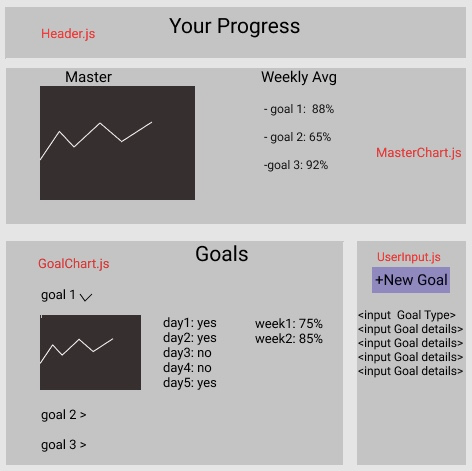

# Goal Setting App

## Application Concept and Wireframe

### Application Concept

- This app will help set SMART goals and track progress
- Will get data from user input
- Full CRUD
  - GET: requires user input
  - POST: user goals will be posted to array
  - PUT: will take in daily progress
  - DELETE: Gets rid of goals

### Funcionality

- header will display EZ-Goalz
- When it loads, it will ask the type of goal you want to set i.e. intellectual, exercise, diet, sleep, mental health, financial etc.
- Once the type of goal has been selected, a template for a SMART goal will prompt the user to enter in specific details that the app will track over time 
  - when the add goal button is pushed, the new goal will be pushed into the goals array.
- The app will show a progress chart for the new goal
- The app will allow the user to input daily progress.
  - There will be a chart for the specific goal, and one for all goals.
- The app will allow the user to update their progress chart by deleting or adding goals.

### Endpoints

- GET - take in parameters for the goals
- POST - push new goals in to the array
- PUT - update goals, and input progress
- DELETE - gets rid of goals

### Component Architecture

- App.js (stateful: hold the users goal(s))
  - Header.js (functional)
  - UserInput.js (stateful: will collect goal details (user input))
    - Charts.js (functional: will display chart for one goal)
    - MasterChart.js (functional: will display overall achievement)
  - UserGoals.js (functional)
    - NewGoal.js (stateful this.state.goal)

### Wireframe

# CODE GUIDE

### Endpoints

- GET - collects goal details: 
  - S: specifics on user goal
    - There will be a template for goals allowing things like frequecy, weight loss, calories, hours slept, etc.
    - user can create different specifications for their goal.
  - M: is the goal measurable? (y/n)
  - A: is the goal attainable/possible (y/n)
  - R: is the goal relevant to bettering yourself? (y/n)
  - T: how long will you track your goal?
- Post - adds the new goal to the goals array
  - goals will stay in App.js and will be passed to the GoalChart.js and MasterChart.js via props
- Put - allows user to make daily updates to their progress
  - This will add a new element to their progress in it's respective goal object in the goals array
- Delete - get rid of old goals
  - if user decides their goal was too aggressive or not aggressive enough, they can change the requirements they have set for their goal or delete it all together.

